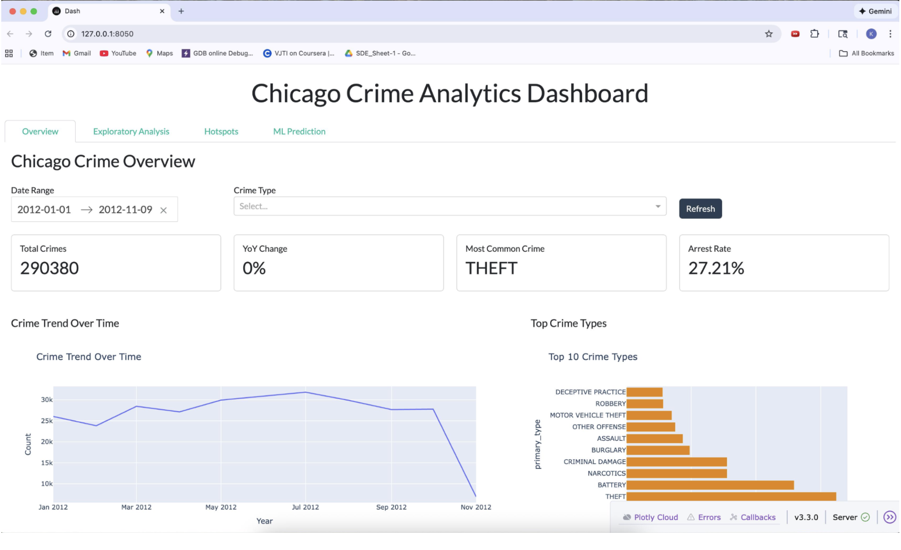
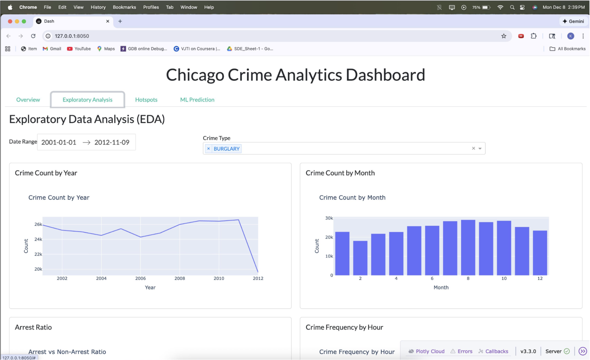
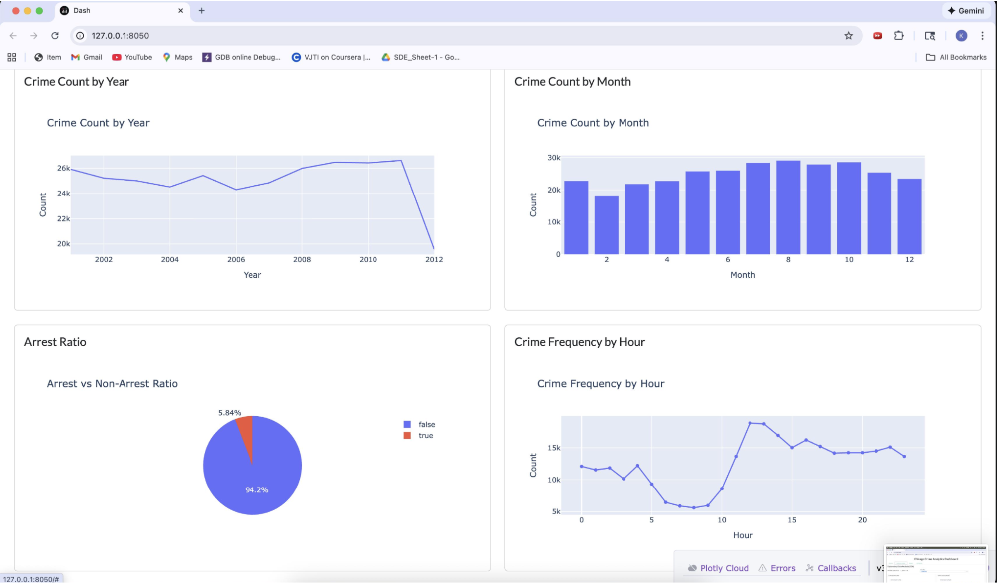
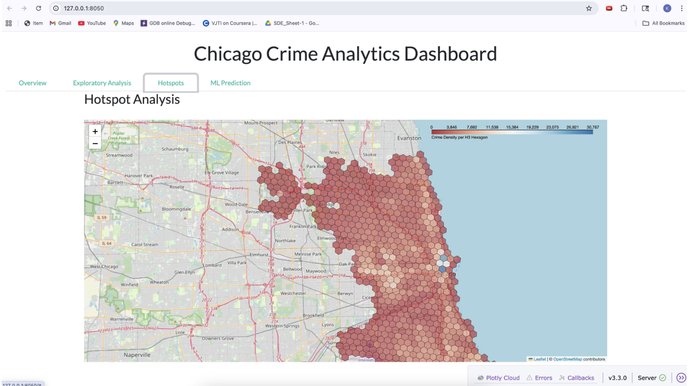
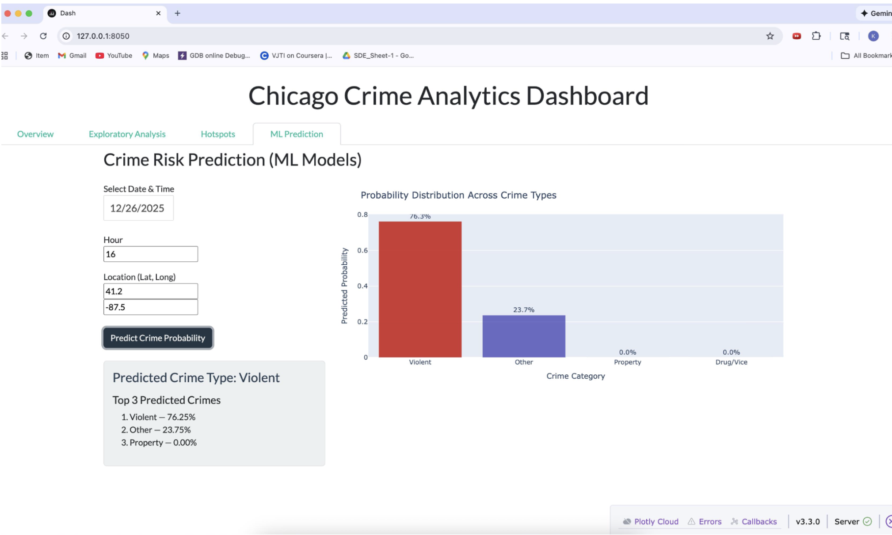
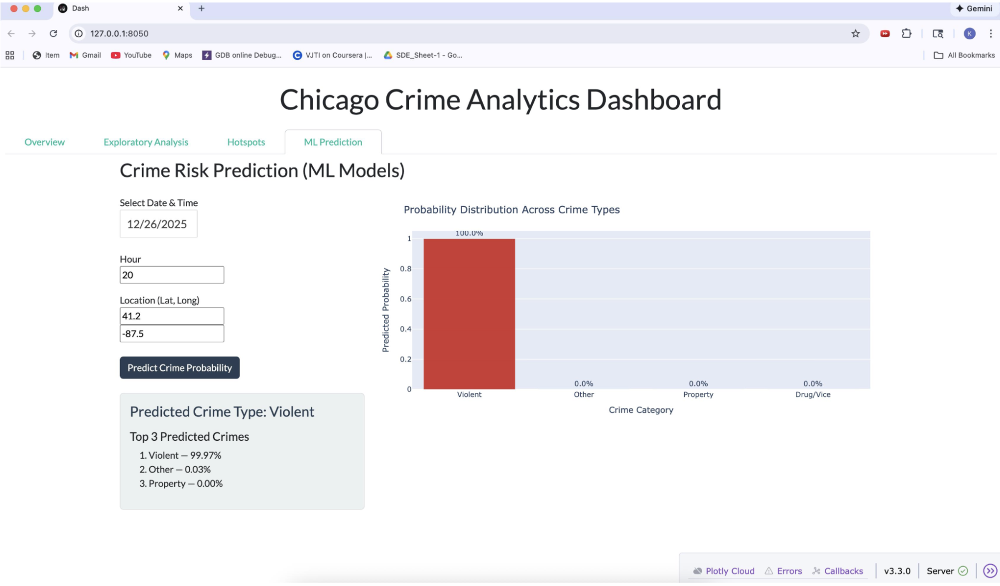

# Chicago Crime Prediction & Hotspot Analysis
**Machine learning pipeline analyzing 8M+ crime records from Chicago (2001–present)**  
Built with: PySpark • XGBoost • Random Forest • DBSCAN • H3 Geospatial • Plotly Dash

---

## 📌 Project Summary

This project predicts crime categories and identifies hotspots across Chicago using 8 million historical crime records. The system uses distributed computing (PySpark) to handle massive datasets, machine learning for prediction, and geospatial analysis for hotspot detection.

**Results:** 50–60% accuracy predicting crime categories | 8–12 major hotspots identified | Interactive dashboard with real-time predictions

---

## 📸 Screenshots

### Overview — KPI Summary & Crime Trends


### Exploratory Data Analysis — Interactive Filters & Charts


### EDA — Arrest Ratio & Crime by Hour


### Hotspot Analysis — H3 Hexagonal Crime Density Map


### ML Prediction — Real-Time Crime Risk Prediction



---

## 🎯 What This Project Does

- Processes 8M+ records using PySpark (too large for Pandas)
- Predicts crime categories using Random Forest and XGBoost models
- Identifies crime hotspots using DBSCAN clustering and H3 hexagonal binning
- Visualizes patterns through an interactive Dash dashboard

---

## 📂 Code Structure

```
notebooks/
├── week1.ipynb   → Data quality check, EDA, visualizations
├── week2.ipynb   → PySpark ETL, feature engineering
├── week3.ipynb   → Geospatial analysis, hotspot detection
└── week4.ipynb   → ML model training (Random Forest, XGBoost)

visualization/
└── dashboard.py  → Interactive Plotly Dash app

screenshots/      → Dashboard screenshots
config/
requirements.txt
README.md
```

---

## 🔍 Where to Start (For Evaluators)

### Week 1: Data Exploration (`notebooks/week1.ipynb`)
- Loaded 8M records from Chicago Open Data Portal
- Identified 200k+ rows with missing GPS coordinates
- Created 10+ visualizations showing temporal patterns
- **Key Finding:** Peak crime hours are 7 PM – 11 PM; summer has the most crimes

### Week 2: Feature Engineering (`notebooks/week2.ipynb`)
- Built PySpark ETL pipeline (Pandas couldn't handle 8M rows)
- Extracted temporal features: hour, day_of_week, month, season, is_weekend
- Reduced 100+ IUCR crime codes → 12 interpretable categories
- **Key Decision:** Category-level prediction instead of exact IUCR codes (solved class imbalance)

### Week 3: Geospatial Analysis (`notebooks/week3.ipynb`)
- Implemented DBSCAN clustering for crime density
- Used H3 hexagonal binning for spatial aggregation
- Generated Folium heatmaps showing hotspots
- **Key Result:** Identified 8–12 major crime hotspot regions (Austin, Englewood, South Shore)

### Week 4: Machine Learning (`notebooks/week4.ipynb`)
- Trained Random Forest (55% accuracy) and XGBoost (60% accuracy)
- Feature importance: Hour > District > Month > Location
- Implemented top-2 prediction strategy for practical use
- **Key Achievement:** 50–60% accuracy on 12-class problem (previously <20% on 100+ classes)

### Dashboard (`visualization/dashboard.py`)
- Real-time crime risk prediction interface
- Interactive maps with H3 hexagons
- Executive KPIs and trend visualizations

---

## 💡 Key Technical Challenges Solved

**1. Massive Dataset Scale**
- Problem: 8M rows crashed Pandas
- Solution: Migrated to PySpark for distributed processing
- Impact: Reduced processing time from hours → ~15 minutes

**2. Severe Class Imbalance**
- Problem: 100+ crime types, many with <1000 occurrences
- Solution: Grouped into 12 high-level categories (Violent, Property, Drug, etc.)
- Impact: Model accuracy jumped from <20% → 60%

**3. Missing GPS Coordinates**
- Problem: 200k+ rows had invalid lat/long
- Solution: Filtered invalid coordinates, used district info as fallback
- Impact: Clean geospatial analysis on 7.8M records

**4. Slow Geospatial Clustering**
- Problem: DBSCAN on millions of points took hours
- Solution: Aggregated by categories + strategic sampling
- Impact: Generated hotspot maps in minutes instead of hours

---

## 🛠️ Technologies Used

| Category | Tools |
|---|---|
| Data Processing | PySpark, Pandas, NumPy |
| Machine Learning | Scikit-learn, XGBoost, Random Forest |
| Geospatial | H3, DBSCAN, Folium |
| Visualization | Matplotlib, Seaborn, Plotly Dash |
| Environment | Jupyter Notebooks, Python 3.8+ |

---

## 📊 Results

| Metric | Value |
|---|---|
| Dataset Size | 8M records (7.9GB) |
| Model Accuracy | 50–60% (12 categories) |
| Hotspots Found | 8–12 major regions |
| Processing Time | ~15 minutes |
| Most Important Feature | Hour of day (0.28) |

**Key Insights:**
- 27% arrest rate across all crimes
- Theft is most common (23%), followed by Battery (18%)
- Summer months show 30% higher crime rates
- Downtown has high theft; residential areas have more violent crimes

---

## 🚀 Running the Project

```bash
# Clone repository
git clone https://github.com/KiranGhumare/Chicago-Crime-Prediction.git
cd Chicago-Crime-Prediction

# Install dependencies
pip install -r requirements.txt

# Run notebooks in order
jupyter notebook notebooks/week1.ipynb   # EDA
jupyter notebook notebooks/week2.ipynb   # Feature Engineering
jupyter notebook notebooks/week3.ipynb   # Geospatial Analysis
jupyter notebook notebooks/week4.ipynb   # ML Models

# Launch dashboard
python visualization/dashboard.py
```

---

## 👥 Team Contributions

**Kiran Ghumare** — Machine learning models (Random Forest, XGBoost), Interactive Plotly Dash dashboard, code cleanup

**Neethu Sathravada** — Data preprocessing and cleaning, PySpark ETL pipeline and feature engineering, geospatial analysis with H3 and DBSCAN

**Sajitha Mathi** — Project report and documentation

---

## 🤖 AI-Assisted Development

Used Claude/ChatGPT for:
- Learning PySpark syntax and debugging distributed computing issues
- Understanding H3 hexagonal binning concepts
- Troubleshooting DBSCAN hyperparameter tuning

Independent work:
- All ML modeling logic and evaluation
- End-to-end dashboard design and implementation
- Architectural decision to use PySpark over Pandas

---

## 📚 Dataset Source

[Chicago Crimes 2001–Present](https://data.cityofchicago.org/Public-Safety/Crimes-2001-to-Present/ijzp-q8t2) (City of Chicago Data Portal)  
Size: 8M+ records, updated daily  
Features: Date, crime type, location (lat/long), district, arrest status, domestic flag

---

## 📧 Contact

**Kiran Ghumare**  
MS Computer Engineering | NYU Tandon School of Engineering  
📧 kg4021@nyu.edu  
💼 [LinkedIn](https://www.linkedin.com/in/kiran-ghumare-a48833190/) | 💻 [GitHub](https://github.com/KiranGhumare)
